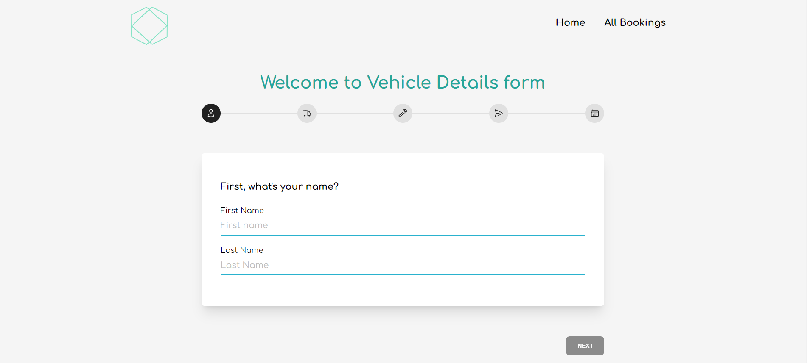
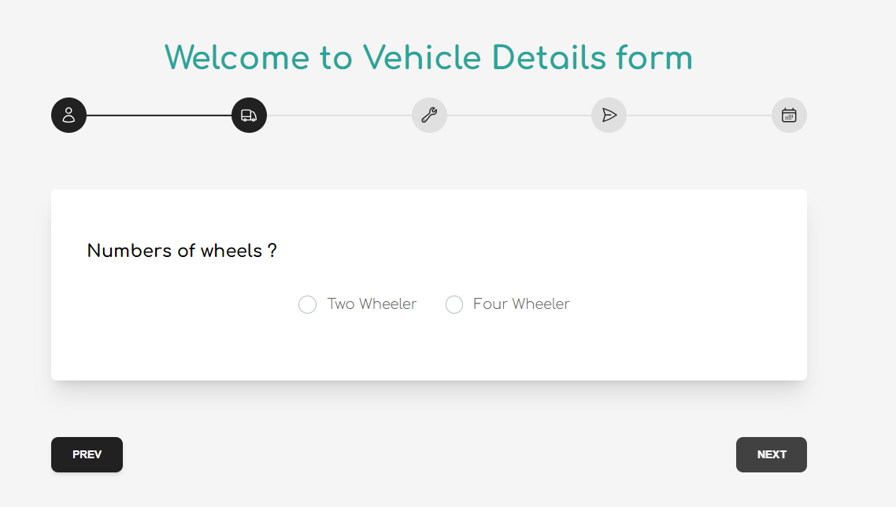
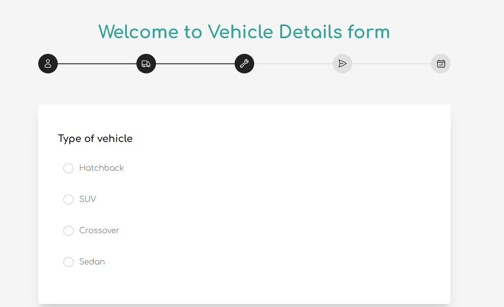
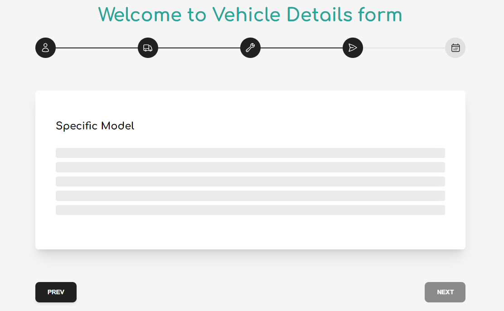
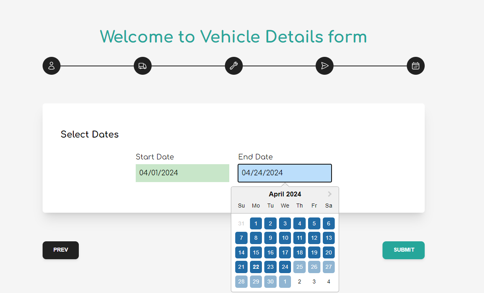
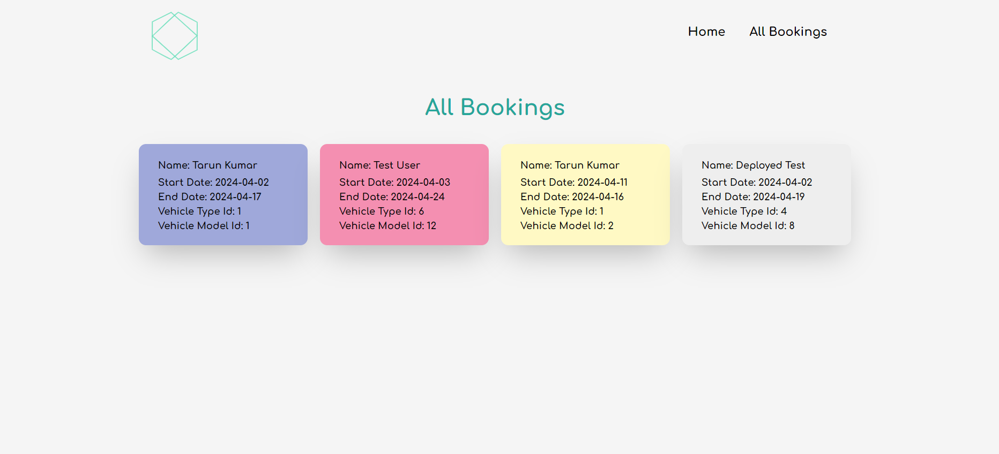

# Project Overview

# Octalogic Tech Full Stack Coding Assignment.

---

The goal of this project is to design and implement a form that collects user information and details about the vehicle to be rented, along with the rental dates. The form will enable users to provide necessary information for renting a vehicle, including personal details, vehicle specifications, and rental dates. This information will be used to process the rental request and manage the rental period efficiently. The form should be user-friendly, intuitive, and secure, ensuring that users can easily enter the required information and submit their rental request.

---

## Deployed Links

- Frontend: https://octalogic-beta.vercel.app/
- Backend: https://octalogic-tech-ass.onrender.com/

---

<h1 align="center">
🌐 SERN Stack App
</h1>
<p align="center">
Sequelize, Expressjs, React/Redux, Nodejs
</p>

<p align="center">
   <a href="https://github.com/amazingandyyy/mern/blob/master/LICENSE">
      
   </a>
   <a href="https://circleci.com/gh/amazingandyyy/mern">
      
   </a>
</p>

> SERN app,Tech Stacks-> Sequelize, Expressjs, React/Redux, TailwindCss, Github, Nodejs.

If the web-app is not responsing, please wait and reload. This may occur due to
Render's free version not responding.

## Requirements

- For development, you will only need Node.js and a node global package, NPM, installed in your environement.

## Clone or Download

```terminal
$ git clone https://github.com/tarun-upadhyay/octalogic_tech_ass.git
$ yarn # or npm i
```

## Project structure

```terminal
client
    - package.json
    - src
        - index.js
        - App.jsx
     - Components
     - Pages
         ---
server
    - package.json
    - app.js
    - controller
        - bookingContoller.js
        - allother controles..
    - DB
       - db.config.js
...
```

## Client-side usage(PORT: 3000)

```terminal
$ cd frontend          // go to frontend folder
$ yarn # or npm i     // npm install packages
$ npm start          // run it locally
```

## Server-side usage(PORT: 5000 || 8080)

```
$ cd backend          // go to client folder
$ yarn # or npm i    // npm install packages
$ npm start        // run it locally
```

### Prepare your secret

- Inside ->.env
- MYSQL_USERNAME
- MYSQL_PASSWORD
- MYSQL_HOST

---

# Features.

# Customer Page

1.  Homepage of Customer's website
    
    
    
    
    

2.  All bookings
    

---

# API Endpoints:
- GET /api/v1/vehicle
   - This endpoint will list out all the wheeler info
- GET /api/v1/vehicle/vehicleType/:id
    - This endpoint is used to get all vehicle types basis on id.
 - GET  /api/v1/vehicle/vehicleModel/:id
   - This endpoint is used to get all vehicle models basis on id.
  ### Bookings
- POST /api/v1/booking/create
   -   This endpoint is used to store all the bookings of a user
- GET /api/v1/booking
  - This endpoint is used to get all booked vehicles.
  
# Thank you for your time

- Thank you for using this application
- Feel free to ask any query.

[My Github](https://github.com/tarun-upadhyay)
https://github.com/tarun-upadhyay

[My Portfolio](https://tarun-upadhyay.github.io/)
https://tarun-upadhyay.github.io/

[Email ME](mailto:tarunu88@gmail.com)

---
